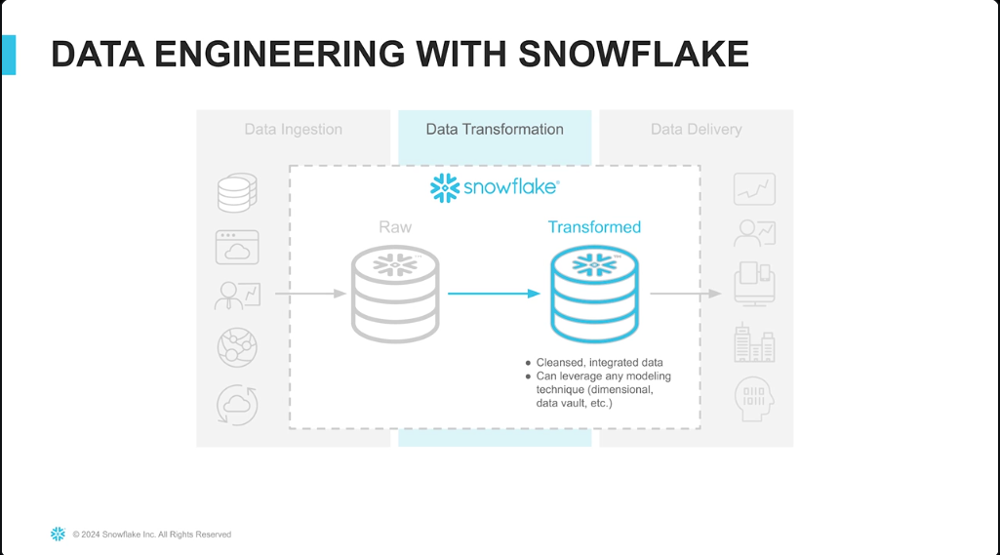
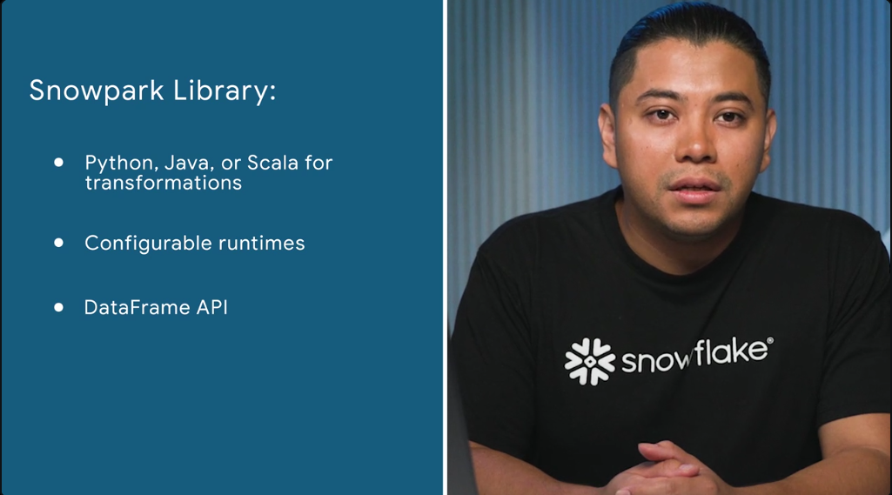
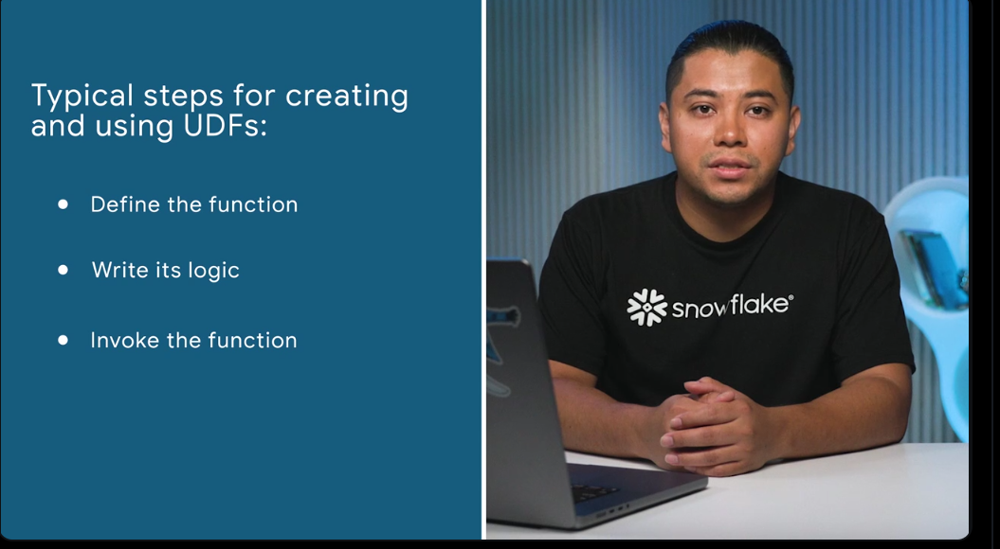
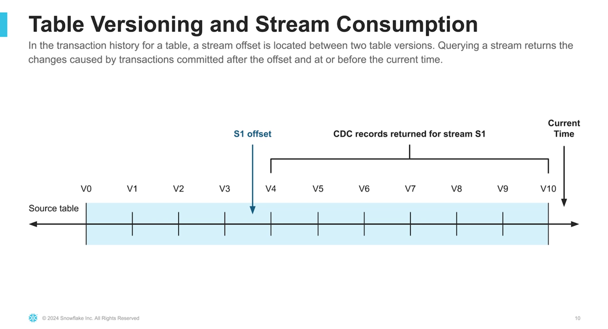
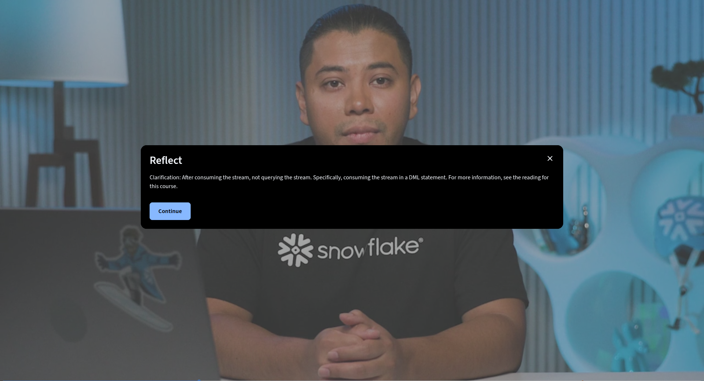
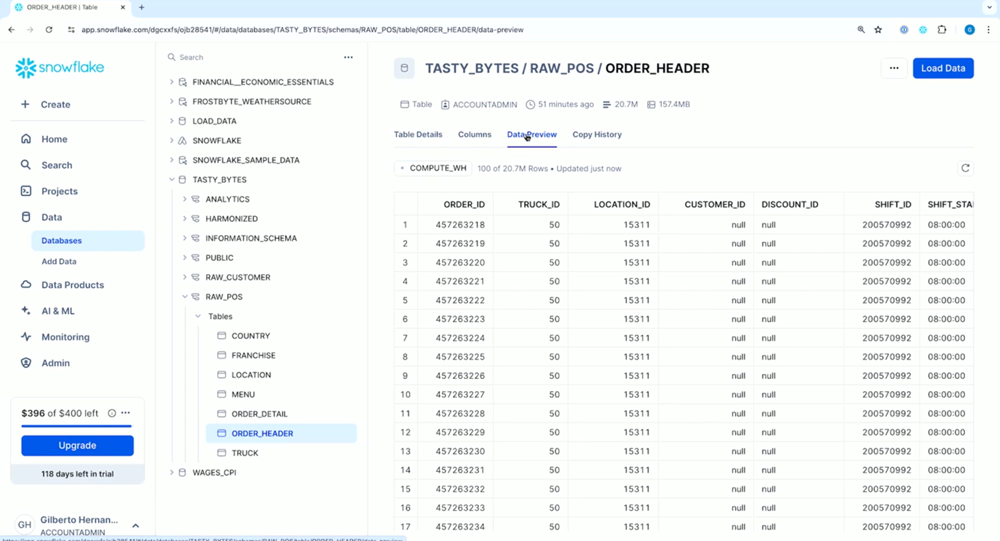
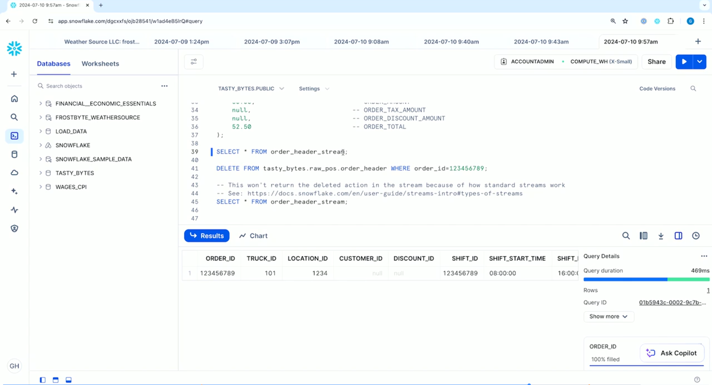
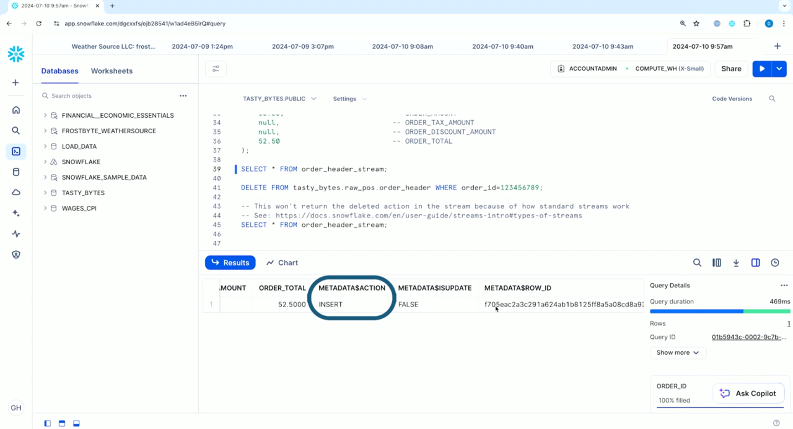
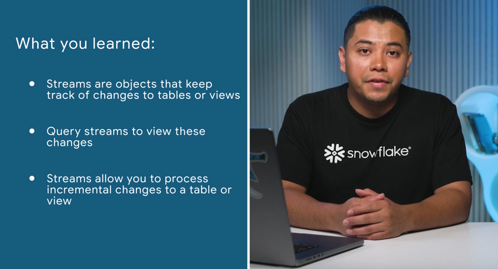

### What are data transformations?

 


### Transformations with SQL

#### snowpark

 

#### Computations with user-defined functions

 

```
USE ROLE accountadmin;

USE WAREHOUSE compute_wh;

USE DATABASE tasty_bytes;

  

CREATE OR REPLACE FUNCTION tasty_bytes.analytics.fahrenheit_to_celsius(temp_f NUMBER(35,4))

RETURNS NUMBER(35,4)

AS

$$

(temp_f - 32) * (5/9)

$$

;

  

CREATE OR REPLACE FUNCTION tasty_bytes.analytics.inch_to_millimeter(inch NUMBER(35,4))

RETURNS NUMBER(35,4)

AS

$$

inch * 25.4

$$

;
```
#### Efficient transformations with streams

- keep precise track of all changes made to a table
- 
- 
- 

  ```
  CREATE OR REPLACE STREAM order_header_stream ON TABLE tasty_bytes.raw_pos.order_header;
  ```
  
  
  - provide information about changes to the table

 ```

DELETE FROM tasty_bytes.raw_pos.order_header WHERE order_id=123456789;

-- This won't return the deleted action in the stream because of how standard streams work
-- See: https://docs.snowflake.com/en/user-guide/streams-intro#types-of-streams
SELECT * FROM tasty_bytes.raw_pos.order_header_stream;

```
 

### Additional Resources

[

  


](https://www.coursera.org/)

[Introduction to Modern Data Engineering with Snowflake](https://www.coursera.org/learn/data-engineering-snowflake/home/welcome "Introduction to Modern Data Engineering with Snowflake - Home Page. Opens in new tab.")

-   [
    
    ](https://www.coursera.org/learn/data-engineering-snowflake/lecture/PZBuG/the-explosion-of-data-and-the-demand-for-insights)
    
-   [
    
    ](https://www.coursera.org/learn/data-engineering-snowflake/lecture/rB5JM/what-we-ll-cover-in-this-course)
    
-   [
    
    ](https://www.coursera.org/learn/data-engineering-snowflake/lecture/fVOCU/modern-data-engineering-with-snowflake)
    
-   [
    
    ](https://www.coursera.org/learn/data-engineering-snowflake/lecture/LoFq0/you-ve-probably-done-some-data-engineering-in-the-past)
    
-   [
    
    ](https://www.coursera.org/learn/data-engineering-snowflake/supplement/1BFKS/how-to-successfully-complete-the-course)
    
-   [
    
    ](https://www.coursera.org/learn/data-engineering-snowflake/supplement/QD46a/have-questions-join-the-q-a-forum-for-this-course)
    
-   [
    
    ](https://www.coursera.org/learn/data-engineering-snowflake/lecture/Yg2we/preparing-your-development-environment)
    
-   [
    
    ](https://www.coursera.org/learn/data-engineering-snowflake/lecture/CzS4y/build-a-really-simple-data-pipeline-in-snowflake)
    
-   [
    
    ](https://www.coursera.org/learn/data-engineering-snowflake/assignment-submission/jXEvw/module-1-assessment-knowledge-check)
    

-   [
    
    ](https://www.coursera.org/learn/data-engineering-snowflake/lecture/S5IbA/what-is-data-ingestion)
    
-   [
    
    ](https://www.coursera.org/learn/data-engineering-snowflake/lecture/BUXiu/batch-ingestion-with-snowflake)
    
-   [
    
    ](https://www.coursera.org/learn/data-engineering-snowflake/lecture/1uxYf/loading-data-from-snowflake-marketplace)
    
-   [
    
    ](https://www.coursera.org/learn/data-engineering-snowflake/lecture/qFpkE/loading-data-using-snowflakes-web-interface)
    
-   [
    
    ](https://www.coursera.org/learn/data-engineering-snowflake/lecture/VrZV0/optimize-compute-resources-for-efficient-batch-ingestion)
    
-   [
    
    ](https://www.coursera.org/learn/data-engineering-snowflake/lecture/1okO0/loading-data-using-snowflake-cli)
    
-   [
    
    ](https://www.coursera.org/learn/data-engineering-snowflake/lecture/ccZzx/loading-data-using-the-copy-into-command)
    
-   [
    
    ](https://www.coursera.org/learn/data-engineering-snowflake/supplement/mw0yr/scenario-briefing-and-account-setup)
    
-   [
    
    ](https://www.coursera.org/learn/data-engineering-snowflake/lecture/goQX0/ingesting-data-from-other-data-systems-using-connectors)
    
-   [
    
    ](https://www.coursera.org/learn/data-engineering-snowflake/lecture/5WsU1/recap-and-best-practices-for-batch-ingestion)
    
-   [
    
    ](https://www.coursera.org/learn/data-engineering-snowflake/supplement/KJmyd/additional-resources-on-batch-ingestion-with-snowflake)
    
-   [
    
    ](https://www.coursera.org/learn/data-engineering-snowflake/supplement/dmKb7/troubleshooting-errors-encountered-in-module-2)
    
-   [
    
    ](https://www.coursera.org/learn/data-engineering-snowflake/assignment-submission/b6wRQ/module-2-assessment-knowledge-check)
    

-   [
    
    What are data transformations?
    
    Video. Duration: 2 minutes2 min
    
    
    
    
    
    
    
    ](https://www.coursera.org/learn/data-engineering-snowflake/lecture/6nIIF/what-are-data-transformations)
    
-   [
    
    Data transformations with SQL
    
    Video. Duration: 5 minutes5 min
    
    
    
    
    
    
    
    ](https://www.coursera.org/learn/data-engineering-snowflake/lecture/e8ys2/data-transformations-with-sql)
    
-   [
    
    Data transformations with Snowpark
    
    Video. Duration: 7 minutes7 min
    
    
    
    
    
    
    
    ](https://www.coursera.org/learn/data-engineering-snowflake/lecture/qGAmo/data-transformations-with-snowpark)
    
-   [
    
    Computations with user-defined functions
    
    Video. Duration: 7 minutes7 min
    
    
    
    
    
    
    
    ](https://www.coursera.org/learn/data-engineering-snowflake/lecture/4sZZs/computations-with-user-defined-functions)
    
-   [
    
    Efficient transformations with streams
    
    Video. Duration: 6 minutes6 min
    
    
    
    
    
    
    
    ](https://www.coursera.org/learn/data-engineering-snowflake/lecture/kLDHe/efficient-transformations-with-streams)
    
-   [
    
    Complex procedural logic with stored procedures
    
    Video. Duration: 6 minutes6 min
    
    
    
    
    
    
    
    ](https://www.coursera.org/learn/data-engineering-snowflake/lecture/uobpY/complex-procedural-logic-with-stored-procedures)
    
-   [
    
    Automatic transformations with Dynamic Tables
    
    Video. Duration: 8 minutes8 min
    
    
    
    
    
    
    
    ](https://www.coursera.org/learn/data-engineering-snowflake/lecture/1uqAs/automatic-transformations-with-dynamic-tables)
    
-   [
    
    Data transformations in Visual Studio Code (Optional)
    
    Video. Duration: 4 minutes4 min
    
    
    
    
    
    
    
    ](https://www.coursera.org/learn/data-engineering-snowflake/lecture/D0Riz/data-transformations-in-visual-studio-code-optional)
    
-   [
    
    Recap and best practices for data transformations
    
    Video. Duration: 1 minute1 min
    
    
    
    
    
    
    
    ](https://www.coursera.org/learn/data-engineering-snowflake/lecture/5PwW0/recap-and-best-practices-for-data-transformations)
    
-   [
    
    Additional resources on data transformations with Snowflake
    
    Reading. Duration: 10 minutes10 min
    
    
    
    
    
    
    
    ](https://www.coursera.org/learn/data-engineering-snowflake/supplement/eKERh/additional-resources-on-data-transformations-with-snowflake)
    
-   [
    
    Module 3 Assessment (Knowledge Check)
    
    Graded Assignment. Duration: 15 minutes15 min
    
    
    
    
    
    
    
    ](https://www.coursera.org/learn/data-engineering-snowflake/assignment-submission/kHffM/module-3-assessment-knowledge-check)
    

-   [
    
    Delivery of data products
    
    Video. Duration: 3 minutes3 min
    
    
    
    
    
    
    
    ](https://www.coursera.org/learn/data-engineering-snowflake/lecture/2tOqm/delivery-of-data-products)
    
-   [
    
    Data sharing on Snowflake Marketplace
    
    Video. Duration: 4 minutes4 min
    
    
    
    
    
    
    
    ](https://www.coursera.org/learn/data-engineering-snowflake/lecture/egVcl/data-sharing-on-snowflake-marketplace)
    
-   [
    
    Streamlit in Snowflake Applications
    
    Video. Duration: 5 minutes5 min
    
    
    
    
    
    
    
    ](https://www.coursera.org/learn/data-engineering-snowflake/lecture/6I0BQ/streamlit-in-snowflake-applications)
    
-   [
    
    Snowflake Native Applications
    
    Video. Duration: 6 minutes6 min
    
    
    
    
    
    
    
    ](https://www.coursera.org/learn/data-engineering-snowflake/lecture/a8jW7/snowflake-native-applications)
    
-   [
    
    Recap and best practices for data product delivery
    
    Video. Duration: 1 minute1 min
    
    
    
    
    
    
    
    ](https://www.coursera.org/learn/data-engineering-snowflake/lecture/j5Zwj/recap-and-best-practices-for-data-product-delivery)
    
-   [
    
    Additional resources on data product delivery with Snowflake
    
    Reading. Duration: 10 minutes10 min
    
    
    
    
    
    
    
    ](https://www.coursera.org/learn/data-engineering-snowflake/supplement/HR9jJ/additional-resources-on-data-product-delivery-with-snowflake)
    
-   [
    
    Module 4 Assessment (Knowledge Check)
    
    Graded Assignment. Duration: 15 minutes15 min
    
    
    
    
    
    
    
    ](https://www.coursera.org/learn/data-engineering-snowflake/assignment-submission/rwgNn/module-4-assessment-knowledge-check)
    

-   [
    
    ](https://www.coursera.org/learn/data-engineering-snowflake/lecture/0OUDc/what-is-orchestration)
    
-   [
    
    ](https://www.coursera.org/learn/data-engineering-snowflake/lecture/dv7bJ/automation-with-tasks)
    
-   [
    
    ](https://www.coursera.org/learn/data-engineering-snowflake/lecture/uXKDo/orchestration-with-dags)
    
-   [
    
    ](https://www.coursera.org/learn/data-engineering-snowflake/lecture/0eqH0/recap-and-best-practices-for-pipeline-orchestration)
    
-   [
    
    ](https://www.coursera.org/learn/data-engineering-snowflake/lecture/Due9E/conclusion)
    
-   [
    
    ](https://www.coursera.org/learn/data-engineering-snowflake/supplement/35tKP/additional-resources-on-orchestration-with-snowflake)
    
-   [
    
    ](https://www.coursera.org/learn/data-engineering-snowflake/supplement/U3PyC/troubleshooting-errors-encountered-in-module-5)
    
-   [
    
    ](https://www.coursera.org/learn/data-engineering-snowflake/supplement/xdaYO/beyond-the-course)
    
-   [
    
    ](https://www.coursera.org/learn/data-engineering-snowflake/assignment-submission/NMECL/course-assessment-knowledge-check)
    

# Additional resources on data transformations with Snowflake

0:08/2:10

We covered a lot in Module 3. Here are some resources I recommend to learn even more about data transformations with Snowflake:

**Data transformations with SQL and Snowpark** 

-   [Query Data in Snowflake](https://docs.snowflake.com/en/guides-overview-queries) – You don't need to read everything in this section, but it does a good job of laying out common ways of querying data in Snowflake.
    
-   [Snowpark for Python | Snowflake Tutorial](https://youtu.be/udcFnIvXFnE?si=prrOJZd41LO3ITvh) by Christopher Marland, Snowflake Data Superhero.
    
    -   In the video, Christopher uses Jupyter Notebooks, but you can also use Snowflake Notebooks.
        
-   [Snowpark Developer Guide for Python | Snowflake Documentation](https://docs.snowflake.com/en/developer-guide/snowpark/python/index) – Everything under this section is great. The "Using DataFrames" section is especially helpful and relevant. Browse the Java or Scala sections if those are your preferred programming languages.
    
-   [Using other Python Packages in Snowpark | by Jeff Hollan | Snowflake Builders Blog](https://medium.com/snowflake/using-other-python-packages-in-snowpark-a6fd75e4b23a) – How to bring in Python packages into a Snowpark development environment.
    

**User-defined functions and stored procedures**

-   [User-defined functions overview | Snowflake Documentation](https://docs.snowflake.com/en/developer-guide/udf/udf-overview) 
    
-   [Snowflake 101: Working with Stored Procedures](https://select.dev/posts/snowflake-stored-procedures) 
    

**Streams**

Minor clarification on streams: **Querying** a stream returns the minimal set of changes from the stream's current offset to the current version of the table. You can query the stream over and over in this way, without affecting the stream's offset (i.e., you'll continue to get the same results). A stream advances the offset **only** when its contents are **consumed.** "Consuming", in this context, means specifically using stream contents in a [DML](https://en.wikipedia.org/wiki/Data_manipulation_language) transaction. 

-   [Stream Examples | Snowflake Documentation](https://docs.snowflake.com/en/user-guide/streams-examples) – The parent section "Streams" is excellent for more information on how Streams work "under the hood".
    
-   [Streaming with Snowflake](https://www.youtube.com/watch?v=zH5umveQW_c) – An excellent technical demo directly from the product manager who helped build Dynamic Tables.
    

**Dynamic Tables**

-   [Best practices for dynamic tables | Snowflake Documentation](https://docs.snowflake.com/en/user-guide/dynamic-tables-best-practices)
    
-   [Getting Started with Snowflake Dynamic Tables](https://quickstarts.snowflake.com/guide/getting_started_with_dynamic_tables/) – (Optional) For more hands-on practice with Snowflake Dynamic Tables.
    

**Snowflake Extension for Visual Studio Code**

-   [Snowflake Extension for Visual Studio Code](https://docs.snowflake.com/en/user-guide/vscode-ext)
