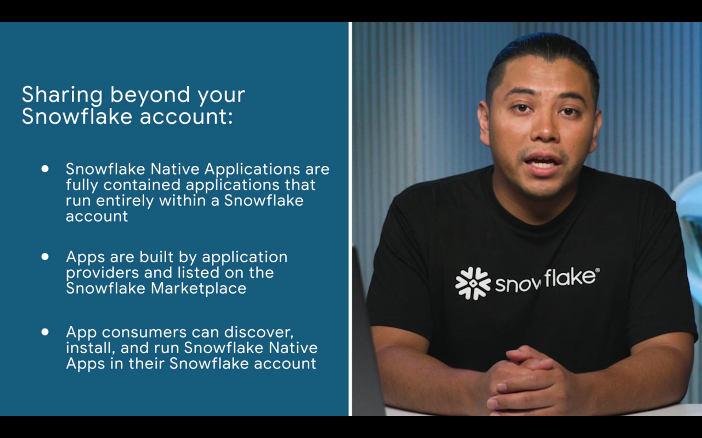
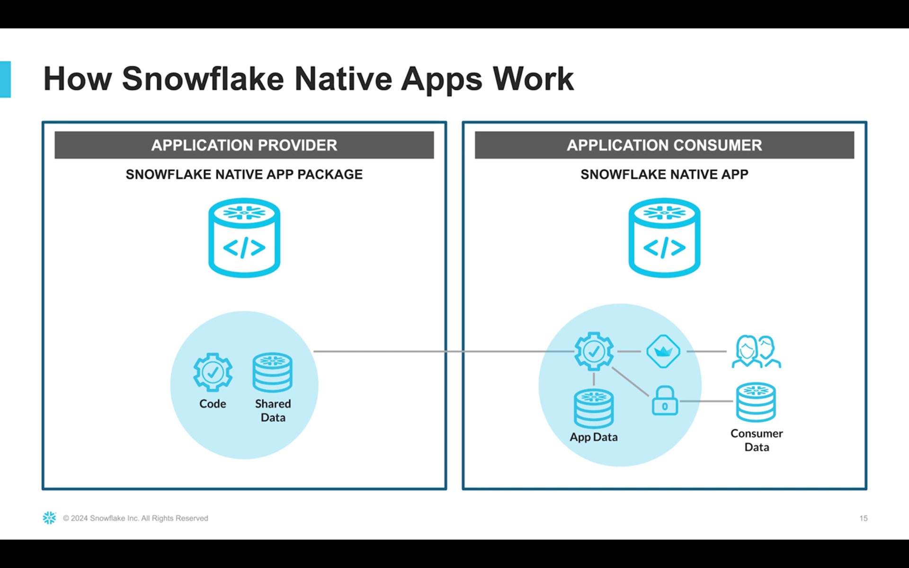
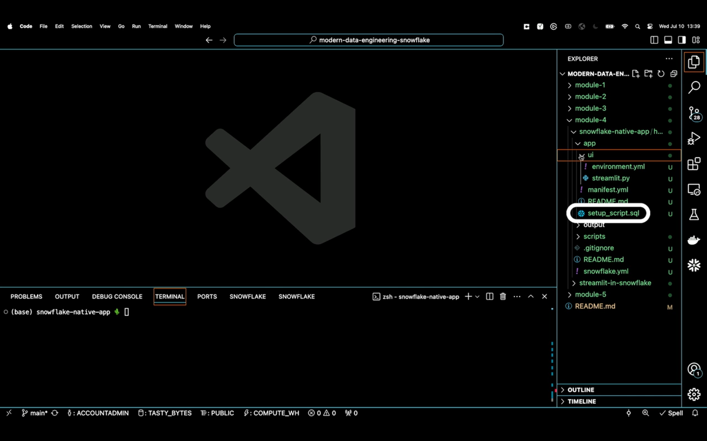
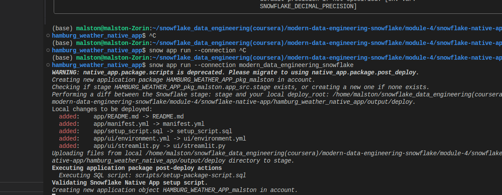
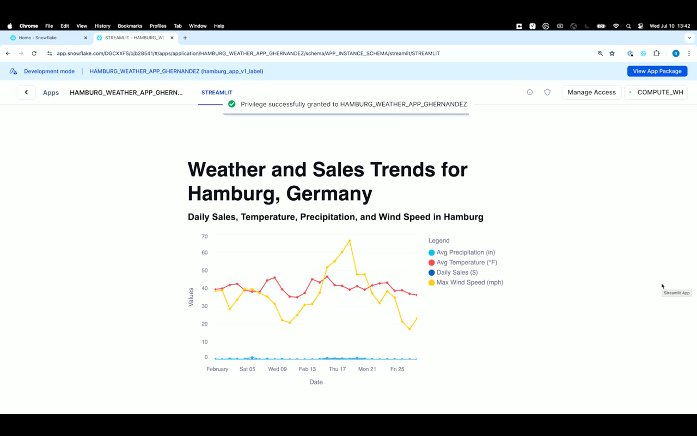
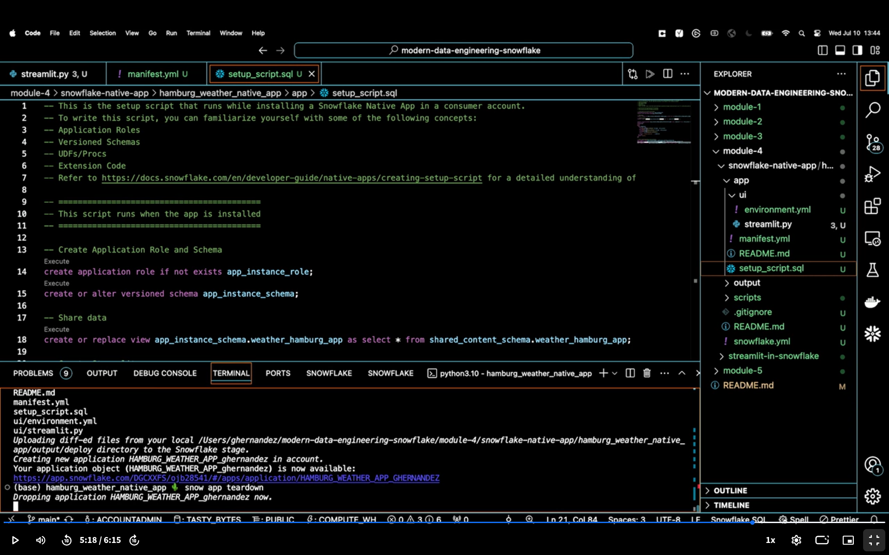

### Delivery of data products

 

- given an input, a pipeline produces an output (something of value)
  - dashboards, data within applications
  - datasets for training ML models

### Data sharing on Snowflake Marketplace

- public listing on marketplace
- 
- 
- 
- 
- 

### Streamlit in Snowflake Applications

- https://github.com/Snowflake-Labs/modern-data-engineering-snowflake/tree/main/module-4/streamlit-in-snowflake

### Snowflake Native Applications

- 
- snowflake container services to run container images within app instead
- 
- 
- 
- 
- 
- streamlit are only within account
- native apps can be listed in market place and consumers an run within their own accounts

### Additional Resources

Here are some resources I recommend to learn even more about data product delivery with Snowflake:

### **Secure data sharing**

-   [Introduction to Secure Data Sharing | Snowflake Documentation](https://docs.snowflake.com/en/user-guide/data-sharing-intro) – A strong overview of secure data sharing in Snowflake. The "Data Sharing & Collaboration" parent section also contains more detail about other aspects of data sharing.
    

### **Streamlit in Snowflake**

-   [Live — Under the Hood: Streamlit in Snowflake](https://www.youtube.com/watch?v=kfrPyZySWqI) – An interview and demo with the product manager that helps build Streamlit in Snowflake.
    
-   [Streamlit in Snowflake: Build Data and AI Apps on the Data Cloud with Python](https://www.snowflake.com/blog/building-python-data-apps-streamlit/) – Blog post from the product manager that helps build Streamlit in Snowflake.
    

### **Snowflake Native Applications**

-   [Snowflake Native App Framework](https://youtu.be/IrKgLGOsUsc) – An overview of the Snowflake Native App framework by the product manager that helps build the framework.
    
-   [How a fictional ski resort helped me understand Snowflake Native Apps | by Gilberto Hernandez](https://medium.com/snowflake/how-a-fictional-ski-resort-helped-me-understand-snowflake-native-apps-b7a6afcb36f7) – An article that I wrote that helped me build the mental model to understand Snowflake Native Applications (this was much needed for me after a decade of building managed applications).
    
-   [Snowflake Native Apps: A New Way to Put Data to Work | by Frédéric L'Anglais](https://medium.com/snowflake/snowflake-native-apps-a-new-way-to-put-data-to-work-8d01816701db) – A great overview of the benefits of Snowflake Native Apps and the types of applications that can be built.
    

### **Snowflake Developer Ecosystem**

These concepts were not covered in this specific course (but will be in a future course), but if you're interested in learning more about how to build applications with Snowflake, consider the following resources:

-   [Native Programmatic Interfaces | Snowflake Documentation](https://docs.snowflake.com/en/user-guide/ecosystem-lang) – A list (with links to documentation) of all of the native programmatic interfaces that can be used to build applications with Snowflake.
    
-   [Live - Developer Experience with APIs & Tooling](https://www.youtube.com/live/99hyhuj31ro) – An interview with the product manager on developer experience on how to build applications with Snowflake, along with a demo by yours truly, dressed as an

