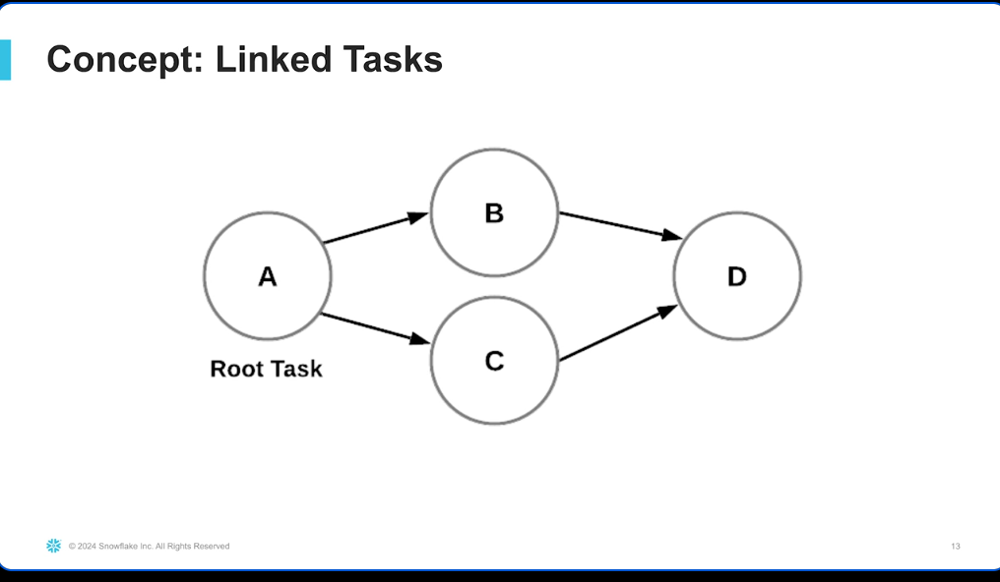
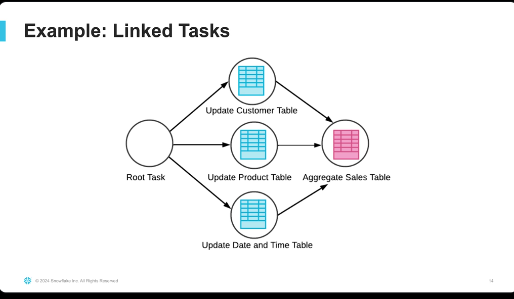
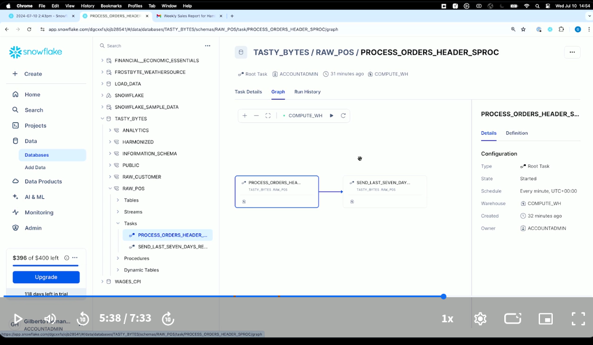
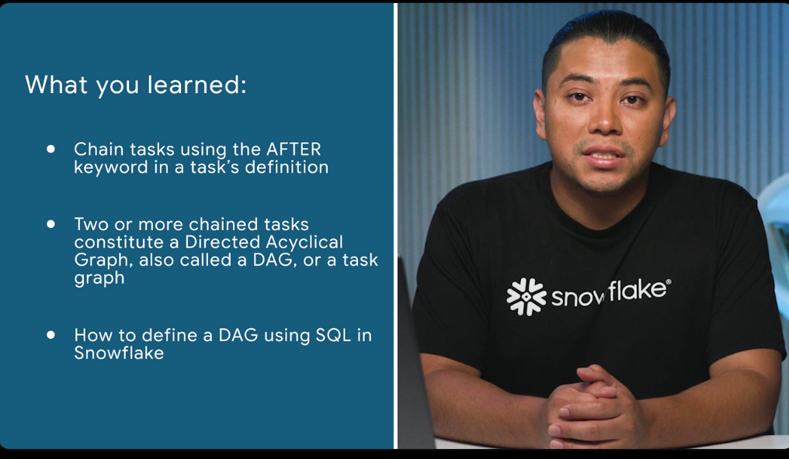

### What is orchestration?

 
- dynamic tables can help with automation
- training to help maintain ML model with fresh data
- orchestration is automation at scale
- TASKS are the magic behind automation

### Automation with tasks

 
- user manged tasks assigns compute resources
- serverless does this for you -- it manages compute resources
- one-line code change
- scheduled with cron expression
- specifying **WAREHOUSE = {...} ** is for a user managed task; omitting this will make this a serverless task
-  

### Orchestration with DAGs

- 
- 
- DAG (directed acyclical graph)

```sql
USE ROLE accountadmin;

USE WAREHOUSE compute_wh;

USE DATABASE tasty_bytes;

  

-- Create an email integration

CREATE OR REPLACE NOTIFICATION INTEGRATION email_notification_int

TYPE = EMAIL

ENABLED = TRUE

ALLOWED_RECIPIENTS = ('email@address.com'); -- Update the recipient's email here

  

CREATE OR REPLACE PROCEDURE tasty_bytes.raw_pos.last_seven_days_report()

RETURNS STRING

LANGUAGE PYTHON

RUNTIME_VERSION = '3.10'

PACKAGES = ('snowflake-snowpark-python')

HANDLER = 'send_email'

AS

$$

import snowflake.snowpark.functions as F

from snowflake.snowpark import Session

  

def send_email(session: Session) -> str:

# Query the 7 most recent entries in the DAILY_SALES_HAMBURG_T table

recent_entries_df = session.table("RAW_POS.DAILY_SALES_HAMBURG_T") \

.sort(F.col("DATE_TRUNC(LITERAL(), ORDER_TS)").desc()) \

.limit(7) \

.to_pandas()

# Convert the DataFrame to an HTML table with styling

html_table = recent_entries_df.to_html(index=False, classes='styled-table')

  

# Define the email content with Snowflake branding and custom styling

email_content = f"""

<html>

<head>

<style>

body {{

font-family: Arial, sans-serif;

}}

h2 {{

color: #29B5E8;

}}

.styled-table {{

border-collapse: collapse;

margin: 25px 0;

font-size: 0.9em;

font-family: 'Trebuchet MS', 'Lucida Sans Unicode', 'Lucida Grande', 'Lucida Sans', Arial, sans-serif;

min-width: 400px;

border-radius: 5px 5px 0 0;

overflow: hidden;

box-shadow: 0 0 20px rgba(0, 0, 0, 0.15);

}}

.styled-table thead tr {{

background-color: #0072CE;

color: #ffffff;

text-align: left;

font-weight: bold;

}}

.styled-table th,

.styled-table td {{

padding: 12px 15px;

}}

.styled-table tbody tr {{

border-bottom: 1px solid #dddddd;

}}

.styled-table tbody tr:nth-of-type(even) {{

background-color: #f3f3f3;

}}

.styled-table tbody tr:last-of-type {{

border-bottom: 2px solid #0072CE;

}}

</style>

</head>

<body>

<h2>Weekly Sales Report for Hamburg</h2>

<p>Here are the last 7 entries in the <strong>DAILY_SALES_HAMBURG_T</strong> table:</p>

{html_table}

</body>

</html>

"""

# Send the email

session.call("system$send_email",

"email_notification_int",

"email@address.com",

"Weekly Sales Report for Hamburg",

email_content,

"text/html")

# Return a success message

return "Weekly sales report email sent successfully"

$$;

  

-- Create task that runs after the process_orders_header_sproc task

-- It calls the sproc above

CREATE OR REPLACE TASK tasty_bytes.raw_pos.send_last_seven_days_report

WAREHOUSE = 'COMPUTE_WH'

AFTER tasty_bytes.raw_pos.process_orders_header_sproc

AS

CALL tasty_bytes.raw_pos.last_seven_days_report();

-- Start the tasks

ALTER TASK tasty_bytes.raw_pos.send_last_seven_days_report RESUME;

ALTER TASK tasty_bytes.raw_pos.process_orders_header_sproc RESUME;

-- Start the DAG

EXECUTE TASK tasty_bytes.raw_pos.process_orders_header_sproc;

-- Stop the tasks

ALTER TASK tasty_bytes.raw_pos.process_orders_header_sproc SUSPEND;

ALTER TASK tasty_bytes.raw_pos.send_last_seven_days_report SUSPEND;
```

- 

- 

### Further learning

-   [Introduction to tasks | Snowflake Documentation](https://docs.snowflake.com/en/user-guide/tasks-intro) – A great resource on many different aspects of Snowflake tasks. Consider the section "Triggered Tasks", which outlines new capabilities for tasks.
    
-   [The definitive guide to using Snowflake Tasks](https://select.dev/posts/snowflake-tasks) – Another great resource written by a Snowflake Data Superhero.
    
-   [Managing Snowflake tasks and task graphs with Python](https://docs.snowflake.com/en/developer-guide/snowflake-python-api/snowflake-python-managing-tasks) – How to use the Snowflake Python APIs to programmatically manage tasks.

I mention this in the course, but the best way to learn even more about how to build data pipelines with Snowflake is by getting hands-on with Snowflake and applying the concepts you learned in this course. To that end, here's a list of resources that offer plenty of opportunities for you to get hands-on:

-   [Snowflake Quickstarts](https://quickstarts.snowflake.com/) – Step-by-step, hands-on guides on all sorts of different technical topics and aspects of Snowflake.
    
-   [Snowflake Developers - YouTube](https://www.youtube.com/channel/UCxgY7r-o_ql8ADIdyiQr3Zw) – Technical videos about Snowflake that range from demos, webinars, follow-alongs, interviews, and much more. Be sure to like and subscribe!
    
-   [Snowflake Builders Blog: Data Engineers, App Developers, AI/ML, & Data Science](https://medium.com/snowflake) – Snowflake's official Medium publication, complete with 100s of technical articles on all sorts of topics related to Snowflake.
    
-   [Snowflake Labs · GitHub](https://github.com/Snowflake-Labs) – Snowflake's official open source GitHub organization, with 100s of repositories that include sample code, tools, snippets, guides, and much more.
    
-   [Snowflake Solutions Center](https://developers.snowflake.com/solutions/) – Technical reference architectures, industry specific use-cases, solutions, and best practices from Snowflake experts and partners.
    
-   [Snowflake Community Forums](https://snowflake.discourse.group/) – Snowflake's official community forums with 1000 of users and discussions on technical topics. 
    

Have fun building with Snowflake!