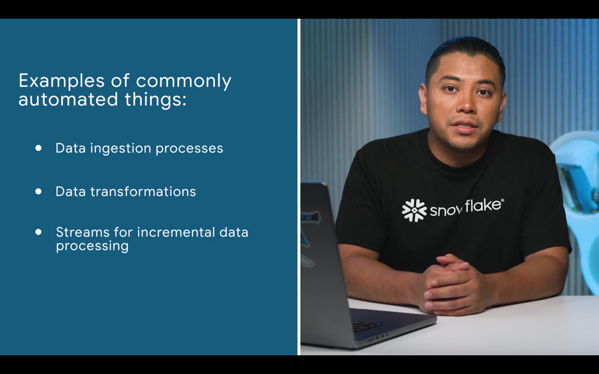
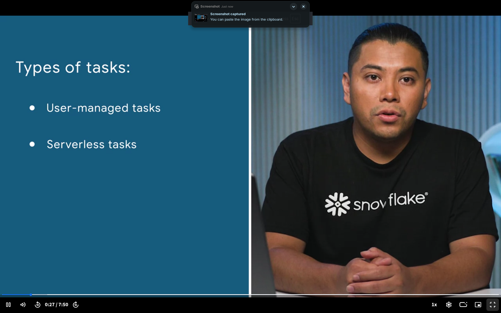
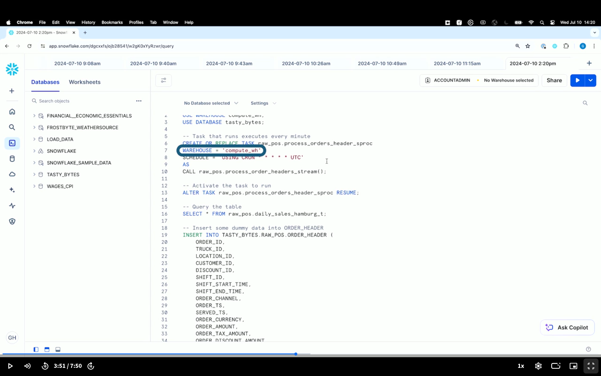

### What is orchestration?

 
- dynamic tables can help with automation
- training to help maintain ML model with fresh data
- orchestration is automation at scale
- TASKS are the magic behind automation

### Automation with tasks

 
- user manged tasks assigns compute resources
- serverless does this for you -- it manages compute resources
- one-line code change
- scheduled with cron expression
- specifying **WAREHOUSE = {...} ** is for a user managed task; omitting this will make this a serverless task
-  
