- by 2025 200 ZetaByte (200 billion TB)
- explosion in amount of data
- corresponding increase in demand to extract insights
- valuable usable insights

## Modern data engineering in snowflake

- [Cloud Data Engineering for Dummies](https://www.snowflake.com/resource/cloud-data-engineering-for-dummies/)
- 
- 
- 
- ingestion, transformation, delivery
- 
- 
- 
- single platform will not solve the challenge of picking an approach to building a data pipeline

### You've probably done some data engineering

- Ingestion, Transformation, and Delivery (ITD)
- Example: importing .csv into excel/google sheet

### Completing the course

- malstonsnowcert12@gmail
- (same as ecosyst)
- https://github.com/Snowflake-Labs/modern-data-engineering-snowflake
- for SF acct:
  - first initial last name
  - pw same as bozman

## Batch data ingestion with Snowflake

### What is data ingestion?

- 80% is getting all of the data into one platform
- 
- Challenges:
  - scale
  - frequency
    - daily? real-time?
  - sources
    - sources are strong dictator to approach to ingestion
  - formats

### Batch ingestion with Snowflake

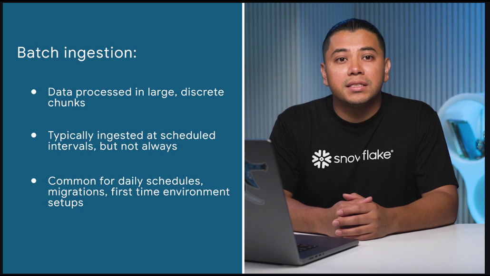 

- commonly used when doing migration or large amounts

  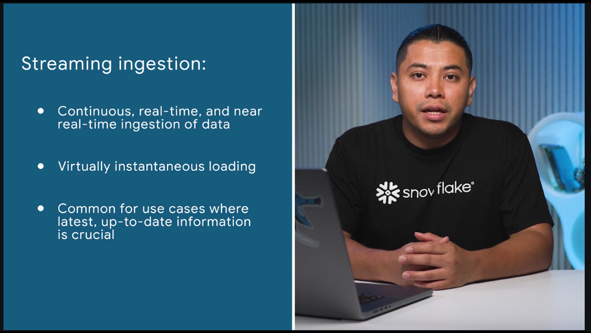

- streaming for financial trading or real-time monitoring

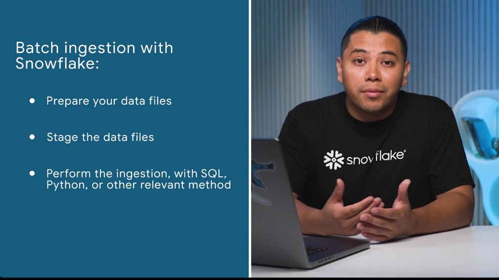 

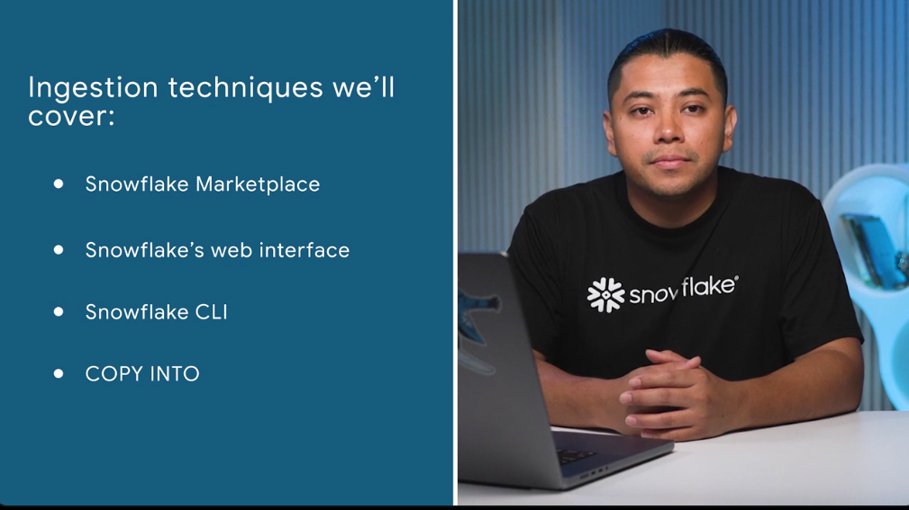 


### Loading data from Snowflake Marketplace

- sf marketplace data completely owned by provider and it's a live dataset
- dataset for training an ml model
- 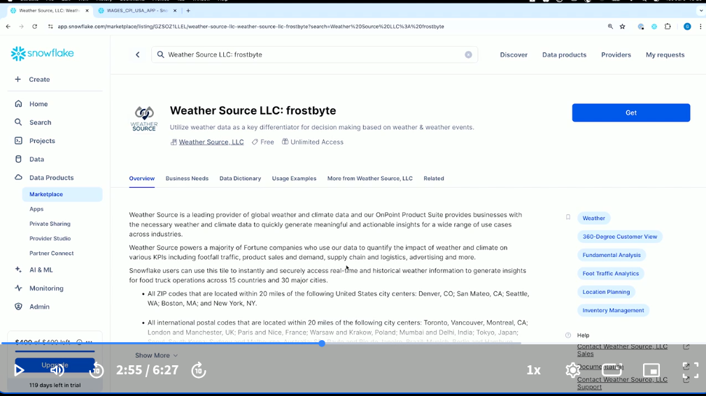
- weather source = pelmorex
- 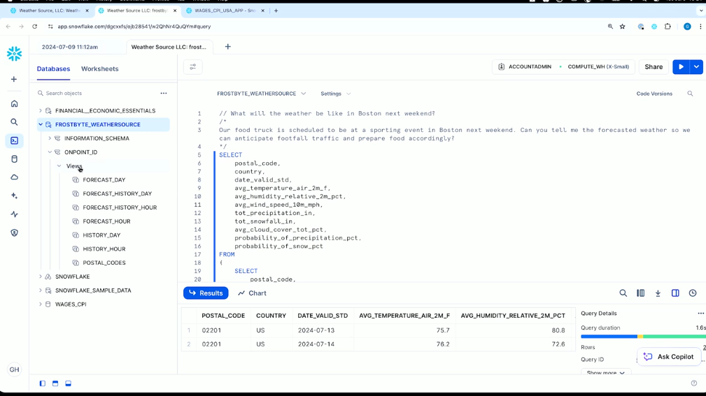


### Loading data using Snowflake's web interface

- using GUI (add data)
- 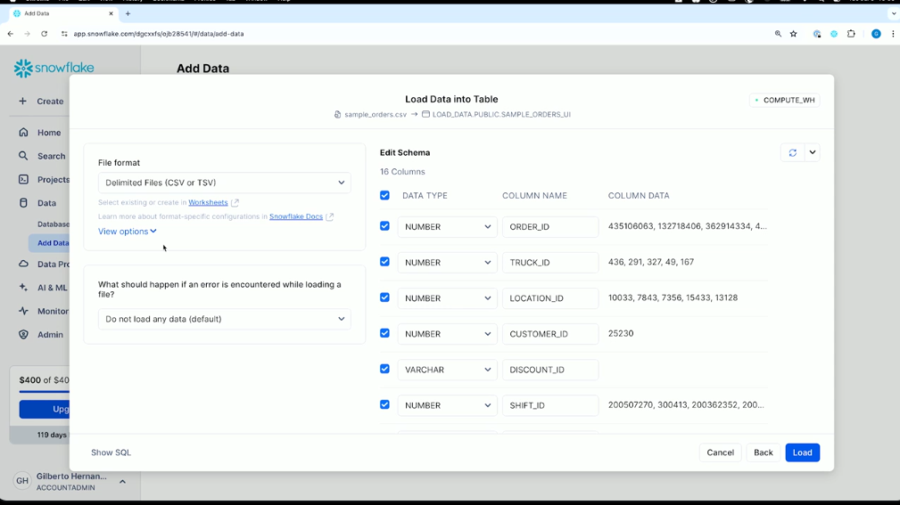
- 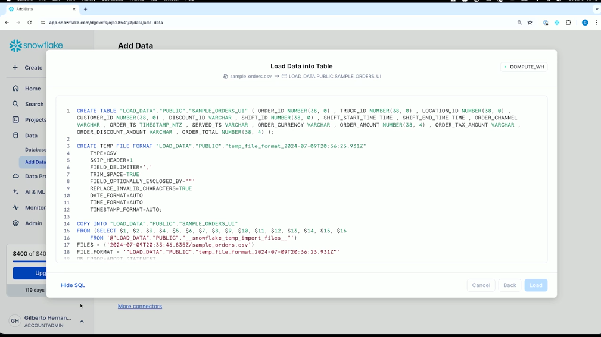


### Optimize compute resources

- compute clusters (one or more nodes)
- For now, let's simply refer to them as compute clusters. ​Compute clusters can be made up of one or more nodes. 

​Each node is a virtual machine that provides a cpu, memory, and ​temporary storage to execute SQL and other operations against your data. ​A single node is able to perform multiple data operations in parallel using threads. ​

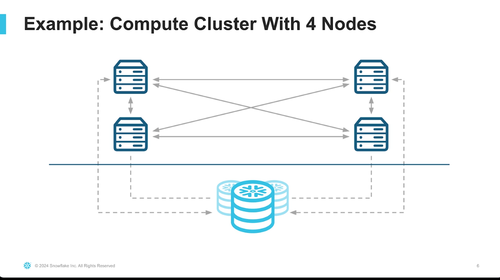 
- warehouses T-shirt size
- 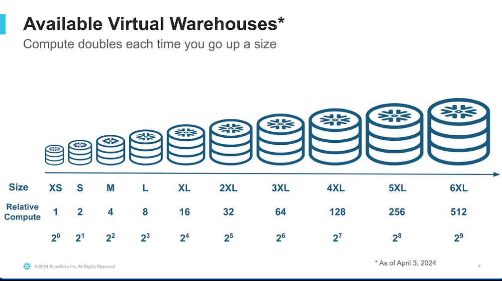
- large the warehouse the more threads
- 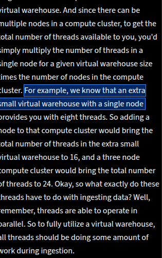
- 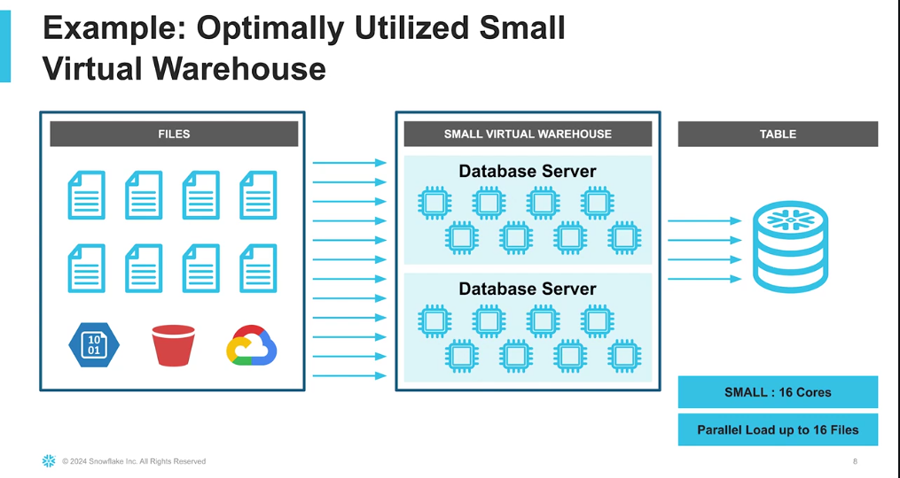
- 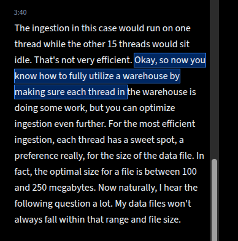
- OPTIMAL SIZE FOR A FILE 100 AND 250 MB compressed
- 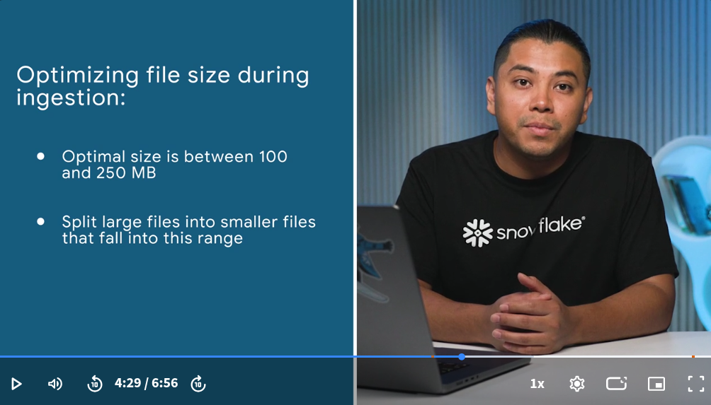
- **smaller files can be processed more efficiently**
- 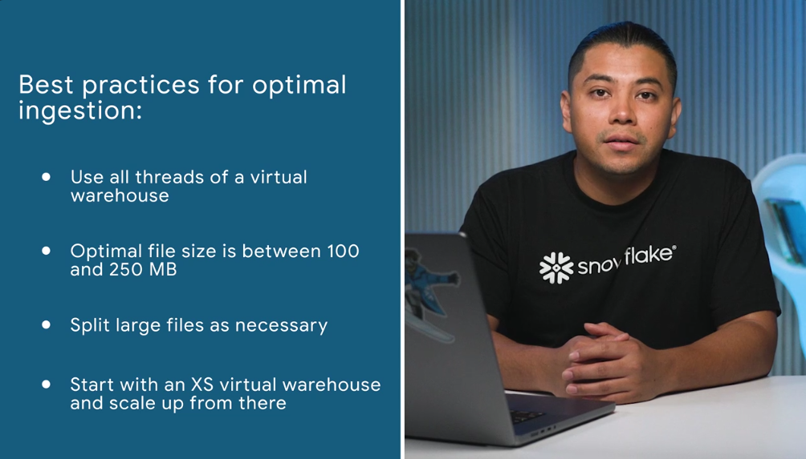
-  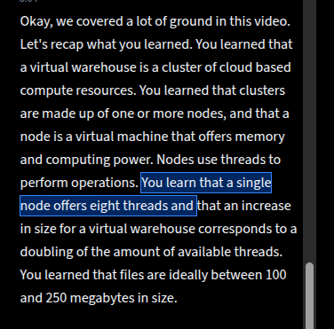


### Loading data using Snowflake CLI

- configure config.tml and connection in snowflake cli
```
default_connection_name = "modern_data_engineering_snowflake"

[cli]
ignore_new_version_warning = false

[cli.logs]
save_logs = true
path = "/home/malston/.snowflake/logs"
level = "info"

[connections.modern_data_engineering_snowflake]
account="WWOCYIE-WNB43301"
user="malston"
password="my(same as password)!same as RI"
warehouse="COMPUTE_WH"
database="LOAD_DATA"
schema="PUBLIC"
role="ACCOUNTADMIN"
```
``` snow connection
 1682  snow connection add
 1683  snow connection test
 1685  cd ../snow*
 1687  cd modern-data-engineering-snowflake
 1692  snow stage create snowflake_cli_stage
 1693  snow connection test
 1694  snow stage create snowflake_cli_stage
 1695  snow stage copy sample_orders.csv @snowflake_cli_stage
 1696  history | grep -i snow
```

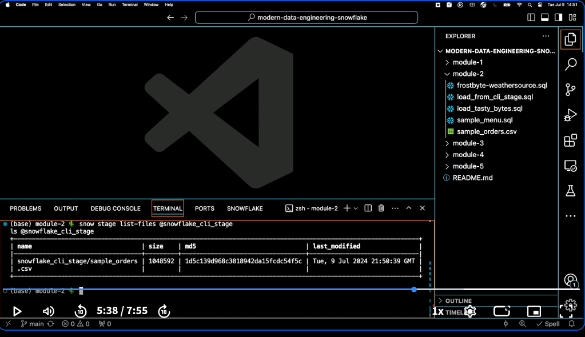
```snow stage copy load_from_cli_stage.sql @snowflake_cli_stage```

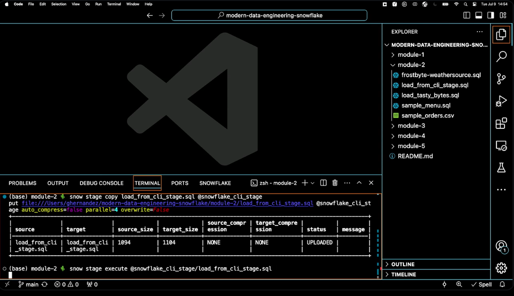 

### COPY INTO command

- copy files into table from a staged file (internal or external)
- 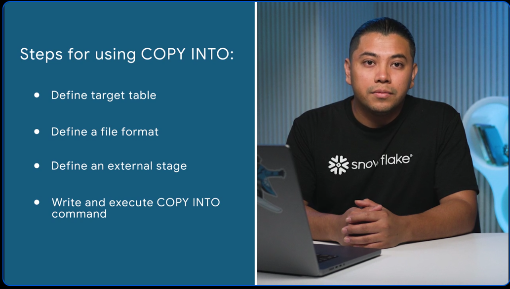
- 

