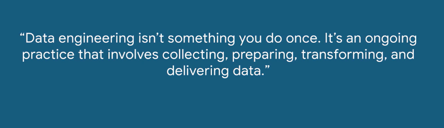
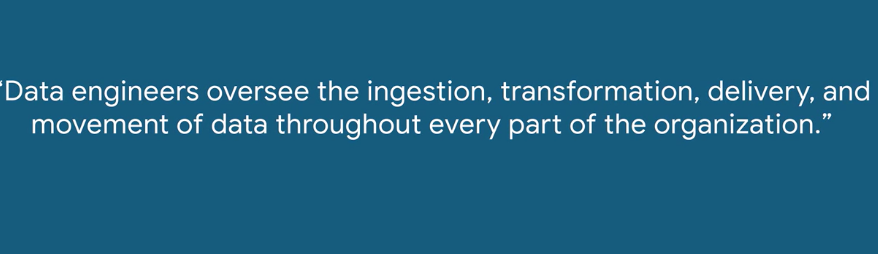
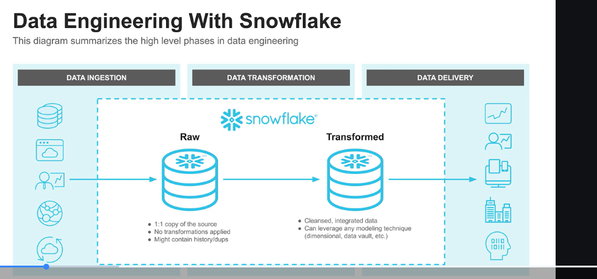
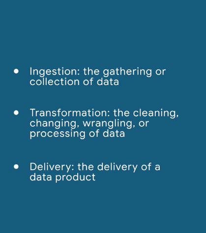
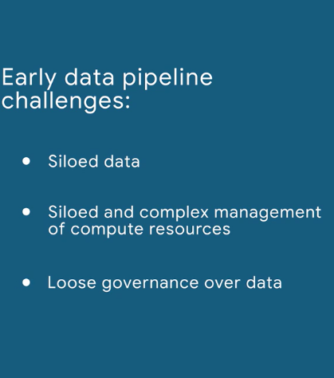
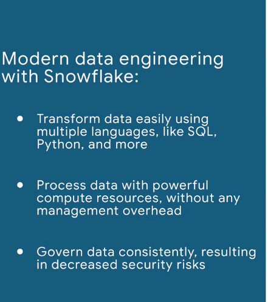
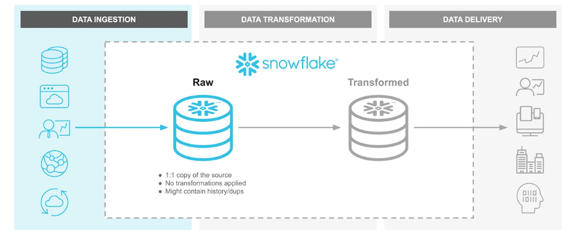

- by 2025 200 ZetaByte (200 billion TB)
- explosion in amount of data
- corresponding increase in demand to extract insights
- valuable usable insights

## Modern data engineering in snowflake

- [Cloud Data Engineering for Dummies](https://www.snowflake.com/resource/cloud-data-engineering-for-dummies/)
- 
- 
- 
- ingestion, transformation, delivery
- 
- 
- 
- single platform will not solve the challenge of picking an approach to building a data pipeline

### You've probably done some data engineering

- Ingestion, Transformation, and Delivery (ITD)
- Example: importing .csv into excel/google sheet

### Completing the course

- malstonsnowcert12@gmail
- (same as ecosyst)
- https://github.com/Snowflake-Labs/modern-data-engineering-snowflake
- for SF acct:
  - first initial last name
  - pw same as bozman

## Batch data ingestion with Snowflake

### What is data ingestion?

- 80% is getting all of the data into one platform
- 
- Challenges:
  - scale
  - frequency
    - daily? real-time?
  - sources
    - sources are strong dictator to approach to ingestion
  - formats 