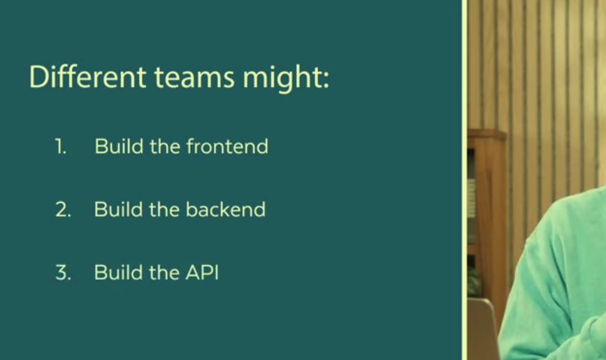
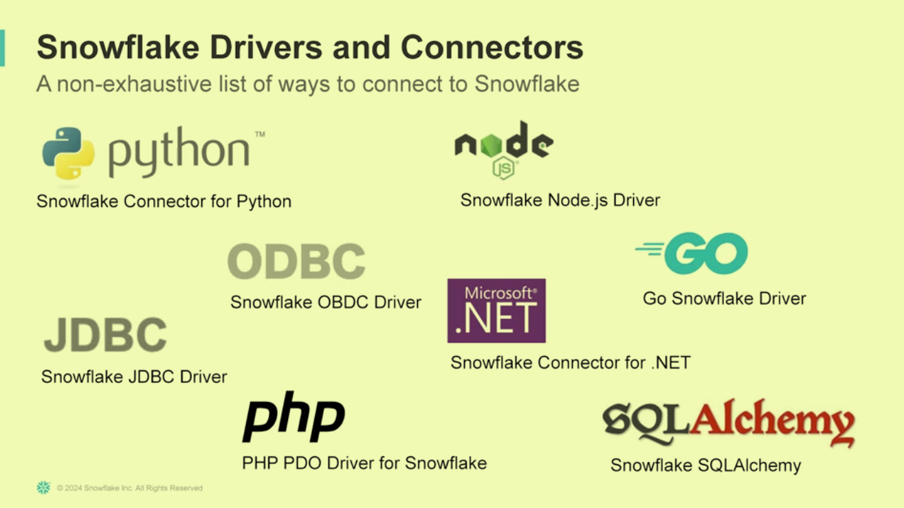
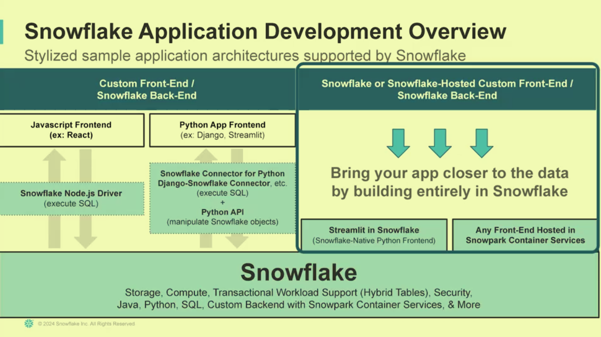

### Overview Part I
- software product to help users do things
- 
- 
- easy to integrate snowflake into broader application stack
- establish connection, execute sql commands based on actions in UI, accommodates large applications
- django snowflake connector
  - works with common django application patterns
- hybrid table to work with web applications without managing different backend technologies

### Overview Part II

 
- can host everything within snowflake

  #### streamlit in snowflake

  - can use it within snowflake acct
    - front end use streamlit python
    - logic powered by snowflake
    - no headache with deployment
  - snowflake native app framework
    - users can purchase and install applications within snowflake account

  ### Streamlit in Snowflake - Part1

[sample code](https://github.com/sterlingalston/snowflake_data_engineering_coursera/blob/master/streamlit_in_snowflake.txt)

